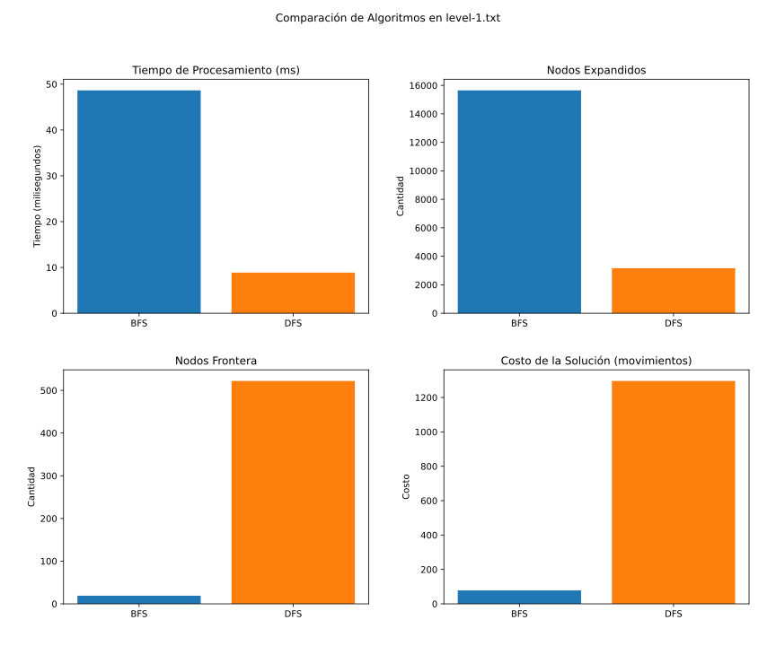
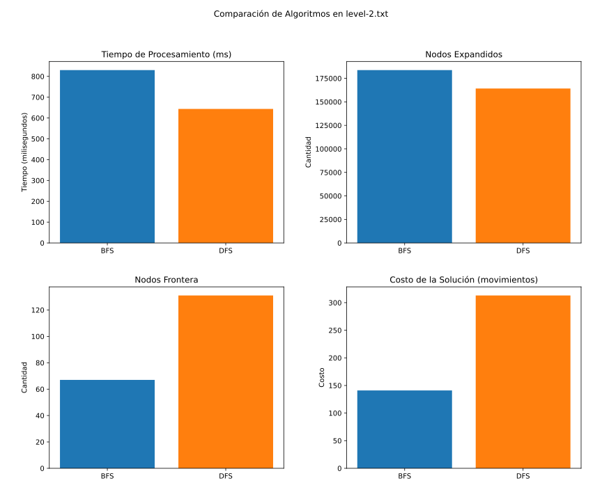
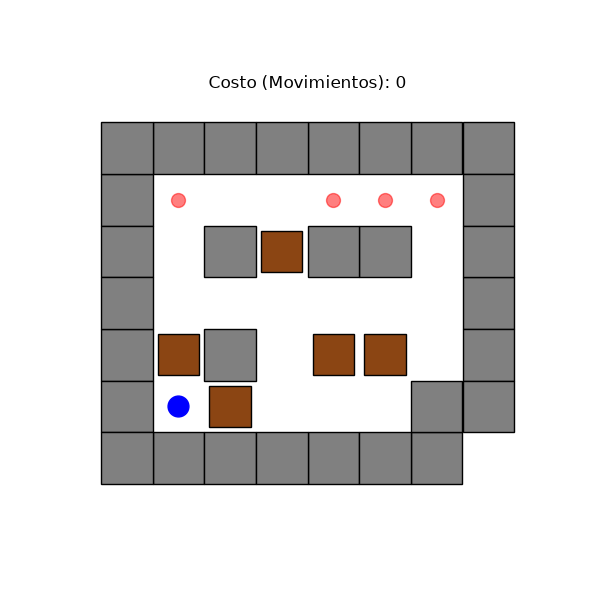

## Introducción

Esta presentación compara el rendimiento de diferentes algoritmos de búsqueda (BFS, DFS) en el rompecabezas Sokoban.

Métricas evaluadas:

- **Tiempo de Procesamiento (ms)**
- **Nodos Expandidos**
- **Nodos en Frontera**
- **Costo de la Solución (movimientos)**

## Comparación Nivel 1

## Comparación Nivel 2

## Animación: Nivel 2

A diferencia de otros niveles, DFS logra encontrar el objetivo en un número razonable de pasos.

:::: {.columns}

::: {.column width="50%"}
**BFS (141 movimientos)**

:::

::: {.column width="50%"}
**DFS (313 movimientos)**

:::

::::

## Análisis

- **BFS** garantiza el camino más corto (costo óptimo) pero expande muchos nodos, requiriendo más memoria (frontera).
- **DFS** puede encontrar soluciones usando menos memoria. 
  - Aunque sus soluciones son subóptimas, en niveles pequeños o altamente constreñidos como el **Nivel 2**, DFS puede tener un rendimiento sorprendentemente decente debido a la restricción del espacio de estados.
